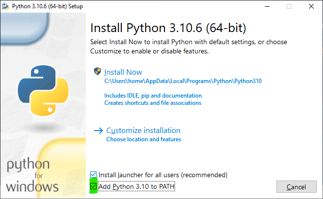
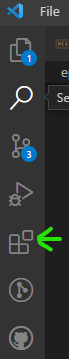
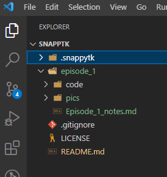
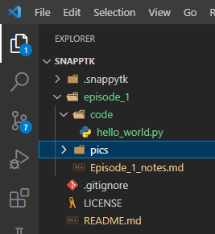

# SnappyTk Episode 1 - Setting up your programming environment

[Back to Episode List](../README.md)

[Watch Episode 1 on YouTube (coming soon)]()

Before you start writing any code you need to have an 'environment' set up on your computer. Don't rush this part, as it can cause problems later down the track.

## Note: Mac/Windows/Linux
Tkinter and Python work on all these OSes. You don't need a powerful computer either. There are some differences though in setting up each of these. You may need to do your own research and learning to get things working on your machine. 

## Install Python
1. In these videos we will be using Python version 3.10 (latest version in 2022)
1. Download Python from [python.org](https://www.python.org/)
1. Install it on your machine
    - If you are on Windows, check the option to add python to you path like the picture below marked in green
    

## Install VS Code (or choose your own editor)
There are lots of code editors you can use to write your software. In this series I am going to use VS Code. You can use whatever you like, but if you are not sure, VS Code is powerful and pretty easy to get started with.

1. Download and install [Visual Studio Code](https://code.visualstudio.com/Download)
1. Once it is installed, run it to open the editor and start exploring

## Setup VS Code
An editor should make writing code easy and fun. You want to think about your ideas and code, not how to use the software to write your code. Spend some time getting used to the editor and setting it up for yourself so that you have a smooth and simple workflow going.

1. Now we will install some extensions. Click on the Extensions icon in the left **Activity Bar** 
2. Search for and install some extensions to help you write your code and work with python. Only the first one is a must install, the others are good but up to you:
   1. [Python](https://marketplace.visualstudio.com/items?itemName=ms-python.python)
       - this will also install other extensions automatically
    2. [indent-rainbow](https://marketplace.visualstudio.com/items?itemName=oderwat.indent-rainbow) - helps with understanding python's indentation requirements
    3. [Rainbow Brackets](https://marketplace.visualstudio.com/items?itemName=2gua.rainbow-brackets) - helps to see pairs of brackets
    4. [autoDocstring](https://marketplace.visualstudio.com/items?itemName=njpwerner.autodocstring) - helps to write internal documentation
    5. [GitHub Pull Requests and Issues](https://marketplace.visualstudio.com/items?itemName=GitHub.vscode-pull-request-github) - if you want to use github with VS Code
    6. [vscode-icons](https://marketplace.visualstudio.com/items?itemName=vscode-icons-team.vscode-icons) - an icon theme
    7. [Tkinter Snippets](https://marketplace.visualstudio.com/items?itemName=NikolaPaunovic.tkinter-snippets) - helps with writing your code
3. Click on the cog icon in the bottom left and choose ***Colour Theme***, then pick the one you like from the list
4. Click on the cog icon in the bottom left and choose ***File Icon Theme***, then pick VSCode Icons from the list

## Setup a working folder
In VS Code it is important to have all your code and files together in one directory to make things easier for you when you are learning. Don't just download code files and open them from your downloads folder. **Move everything into your working folder and keep it organised.**

1. From the *File* menu choose the *Open Folder* option
2. Navigate to the location where you want to store your working folder. It could be on your desktop, in your documents or on another drive. Pick a location and use it consistently. I use *Documents*
3. Create a new folder here to store your code and files. Give it a simple name without spaces. Something like *snappytk*
4. Click on the new folder and then the *Select Folder* button to open this folder as your base working folder in VS Code

## Create a Python Virtual Environment
When building applications with Python it is a good idea to use a virtual environment approach. This just keeps things consistent and separated from any other projects you may be working on. It also makes repeating the environment you used to create your software on a new machine easy.

For more information on the why, what, how of using python virtual environments, [read more at this link](https://realpython.com/python-virtual-environments-a-primer/).

1. Open a *New Terminal* window from the *Terminal* menu option
2. Depending on your OS you will use a different command such as:
   1. Mac: *python3 -m venv .snappytk*
   2. Windows: *python -m venv .snappytk*
3. Wait a moment for the command to complete
4. You should now see a .snappytk folder appear in your folder list in VS Code like the pic below


## Test out your setup
Now that you have software installed and setup, it is time to test to see if it all works!

1. Create a new file called *hello_world.py*
2. Make sure it is not in the .snappytk folder but outside this. I put mine in a *code* folder like in this pic

3. You should now be able to type your code in the new *hello_world.py* in the editor window
4. Type in the code below and save your file: and save your file
    ```
    print("Hello, World!")
    ```
5. Run your code from the *Run* menu, or use the the 'play' arrow in the upper right of the editor window to run the python file.
6. You should see the message *Hello, World!* print out in the terminal window that appears at the bottom of the screen.

## Change the python interpreter
When we ran the code before we most likely were using the default python interpreter. This is not using our virtual environment that we created! We need to change to it and try running the code again.

1. Use the keyboard shortcut Ctl+Shift+p on Windows or Cmd+Shift+p on Mac to open the *Command Palette*
2. Type *Select Interpreter* into the search box and choose the option *'.snappytk': venv* to use the virtual environment you created
3. In the terminal window below the editor, click the trash can icon to remove the current terminal window
4. Run your code again and a new terminal will appear. This time you should see (.snappytk) at the front of some of the lines to tell you that you are using the virtual environment's version of python
5. Great work!

### Note: For windows users with powershell errors
If you see a powershell error about not being able to 'activate' the virtual environment, run the line of code below in the powershell terminal and then try to run your python code again.

    Set-ExecutionPolicy -ExecutionPolicy Unrestricted -Scope CurrentUser

# Great work
Did you get it all working? Give yourself a pat on the back for getting through the setup.

Perseverance is an important skill to work on as you grow and hone your software development skills. No matter how much experience you have there are always problems you have to overcome.

**Now go and explore VS Code some more**. I recommend learning some of the keyboard shortcuts, installing any more extensions you find you want to try, or just checking out the interface and hovering and clicking on things!