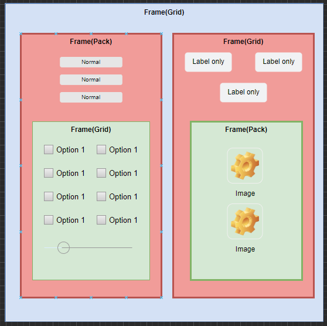
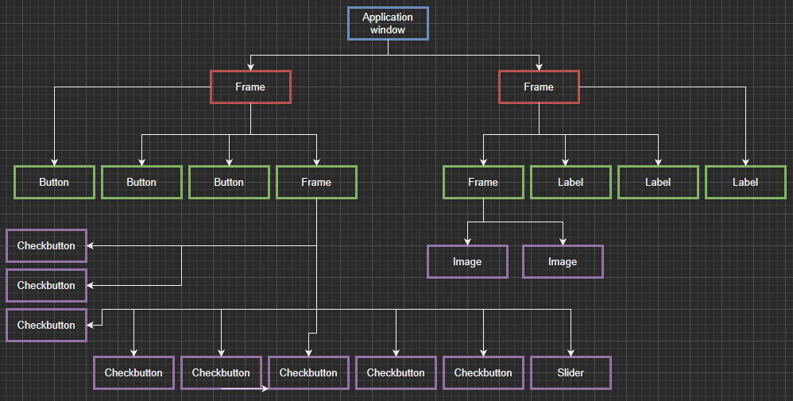

# SnappyTk Episode 5 - Layout and widget hierarchy

[Back to Episode List](../README.md)

[Watch Episode 5 on YouTube](https://youtu.be/s-_uAEhSH3g)

Now that we have seen how the different layout managers, place, pack and grid, we need to understand that Tkinter uses a layout and widget hierarchy model to display and manage all the widgets and windows in your application.

## Layout Hierarchy
Take a look at the layout below:

Here you can see we have a frame at the top of the layout (in blue). This is our parent object and it is using the grid() manager to layout two more frames (in red).

These frames have other widgets inside and use pack() in the left frame and grid() in the right frame to layout their widgets.

Finally we have two more frames (in green) that also use either grid() or pack to layout the objects inside them.

So you can see that container objects, like frames, can use one layout manager per frame, and they can also have other frames inside them that use a different layout manager.

*The only restriction is that a frame has to layout all its children with the same layout manager*. You can't mix pack() for some widgets and grid() for other widgets inside the same container.

## Widget Hierarchy
Now take a look at the widget hierarchy picture below:

So widgets have a hierarchy too, and each widget has a parent (except the application root object), and may also have one or more children.

In this hierarchy you can see that the *Application window* object is the parent window, and it has two children, both frames. These frames have their own children and so on until we get down to the bottom level objects in purple.

In tkinter you can use these hierarchies to move up and down between widgets, but we will look at that later once we have more understanding of layouts and widgets.

**NOTE:** *The important thing to remember is that you need to plan your layouts and widgets with these hierarchies in mind.*

Take the time to plan your application layout and it will make it much easier to build it!

## Practice
Take a look at the code [here](code/layout.py) to see a simple layout and widget hierarchy in action. Here we have a window with two frames and some buttons, using both grid() and pack() layouts.

You will notice that each of the frames takes up the minimum amount of space it can, and so we just see the buttons and the blue background of the window.

Unless we layout the frames to fit into all available space, they will remain tightly wrapped around the buttons.

Try these two exercises:
1. make one of the top buttons stretch to **fill** the horizontal space and see what happens
2. add some padding to the bottom buttons in the grid layout and see what happens