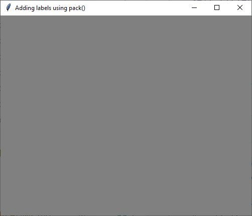
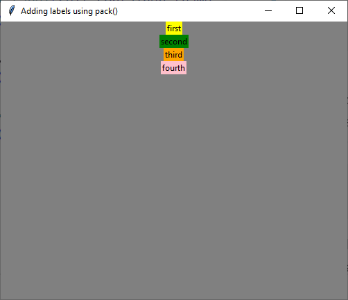
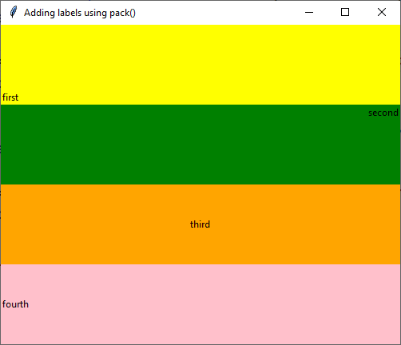
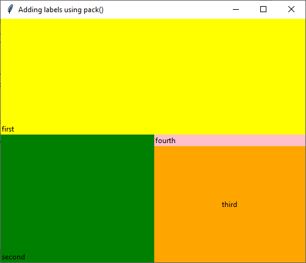

# SnappyTk Episode 6 - Packing a frame with labels

[Back to Episode List](../README.md)

[Watch Episode 6 on YouTube](https://youtu.be/KBPhPnRcj30)

[Get the code for Episode 6 here](code/packing_labels.py)

Now let's try adding some labels to a frame widget and see if we can start to understand how to use the *pack()* layout manager better.

## ttk Widgets
    from tkinter import ttk
The first new thing here is we are using *ttk* widgets, with the extra 't' standing for *themed* tk widgets. These allow us to use styles to better manage the look of our widgets, and these are usually the best widgets to use in your interfaces.

## Adding a style
    self.style = ttk.Style()
    self.style.configure("TFrame", background="grey")
This code creates a style object and then configures it to change the style for all frames to have a grey background. Using styles with ttk widgets can make changing the look of your widgets an easy proces!

## Adding a frame to hold our widgets
    self.container_frame = ttk.Frame(self)
    self.container_frame.pack(fill=tk.BOTH, expand=1)
In the first line we add a frame widget. **Frames** are widgets that can have other widgets, or *children*, added inside them. Each frame uses its own layout manager to layout the widgets inside it.

We then pack this frame into our main application window, and we also tell it to fill and expand to take up all the space. The style we added makes the frame a grey colour as well.

## Adding a label and adjusting layouts
    self.first = ttk.Label(self.container_frame, text="first", background="yellow", anchor=tk.SW)
    self.first.pack(fill=tk.BOTH,expand=1, side=tk.TOP)

There is a lot going on in these two lines!

We first create a label, and then we pack it on the second line. Notice that when we create the label we set its parent(or master) to the frame (*self.container_frame*) not the application window.

We also set the text to display and the background colour.

Then there are three other parts of code to practice with now:

    anchor=tk.SW
If the label has space to move the text around, you can tell it where to display using compass co-ordinates. You can also use 'center' to set the text in the middle of the label. You can either use **tk.W** or **'w'** when you specify the anchor.

    fill=tk.BOTH
**fill** tells the widget to use up the space it has available to it when it is packed into the container.

     expand=1
**expand** tells the widget to take up any available size if the parent changes size, or if there is size available in the parent object.

You can combine fill and expand in different ways to get the result you want. Try it out to get a feel for how they work.

    side=tk.LEFT
**side** packs the widget into a 'side' of the container, which could be one of: top, left, right or bottom. Using the *side* argument can make your layouts change a lot and allow you to completely change your widget layout. Take some time to experiment with a few widgets and varying which side you pack them to.

## Practice
Using just a frame and some labels. Try to make a country's flag such as Belgium, France or the Netherlands.
