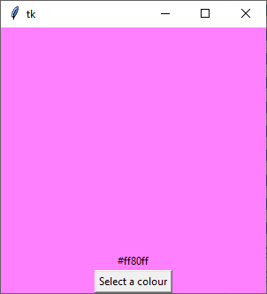
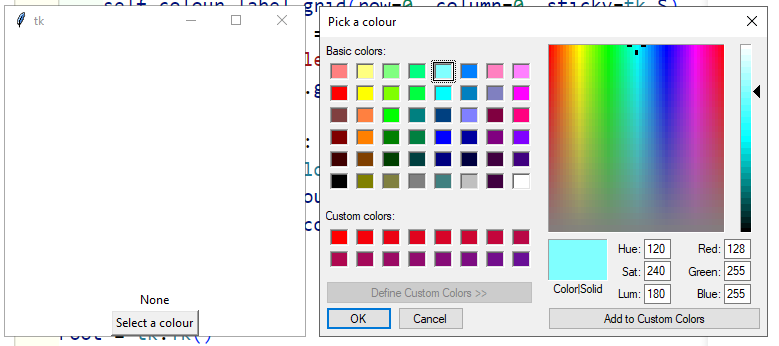

# SnappyTk Episode 8 - Labels with images

[Back to Episode List](../README.md)

[Watch Episode 8 on YouTube](https://youtu.be/b-85bAuDFkc)

[Get the code for Episode 8 here](code/picking_colours.py)

In this episode we are looking at how we can use a **Button**, a **tkinter variable** and the built-in **colorchooser** module to make a simple interactive window. Below is an example of the end application:



## Good code practices
In this application we are starting to build more functionality and complexity into our software. As we do this we should try to write the code in a way that is consistent and easy to understand.

To do this we create separate functions for:
1. configuring our gui
2. adding widgets

Then we call these functions in our __init__() procedure when our class runs. Here is the example of this:
```
   class SnappyTk(tk.Frame):
       def __init__(self, master):
           self.master = master
           super().__init__(self.master)
           self.configure_ui()
           self.create_interface()
```
Notice how we are trying to keep our code simple and clean here. We want to keep our init function to a streamlined, efficient function.

## Using a tkinter variable
To keep track of the colour value we are using a tkinter variable, **tk.StringVar**. These variables are good to use whenever you want your data to be used by widgets instead of just using a normal python variable. 

Just remember: **You have to use the get() and set() methods to get and set the variable's value**.

```
     self.colour = tk.StringVar(value='#ffffff')
     self.colour_label = tk.Label(
        self, 
        textvariable=self.colour, 
        bg=self.colour.get()
    )
```
In the code above you can see that we created a String Variable and assigned its starting value to '#ffffff' for white. The we attached this variable to the label object using the **textvariable=self.color** argument. This means whenever the variable's value changes, the label's text will change automatically and we don't have to do anything!

We then also used the variable again to set the label's background color. This time we need to get the value from inside the variable, so we have to use the **get()** method to do this.

## Creating a button
Now we just want a button to click on! So we create one and tell it to show some text on the button, and also we set its **command** argument.

    self.colour_button = tk.Button(
        self, 
        text="Select a colour", 
        command=self.select_color
    )

The 'command' is the name of a function that is going to run when you click the button. In this case it is going to be the function that allows us to select a colour.

## Using the colorchooser
Now we just need a function to allow the user to select a color when they click on the button. Here it is:

    def select_color(self):
        self.colour.set(colorchooser.askcolor(title="Pick a colour")[-1])
        self.config(background=self.colour.get())
        self.colour_label.config(background=self.colour.get())



There are a few things to note here. We use the colorchooser module to show a nice dialog box that allows the user to select a colour. 

The value that comes back from the colorchooser contains the colour numerically and as a string. We only want the string part here so we put **[-1]** on the end of the line to get the last item in the returned values, the hexadecimal string value representing the colour picked by the user.

Then we use this value to set the variable we created earlier, and finally we call the **config()** method on the frame and the label to change their background colours.

## Practice
See if you can add another button that resets the frame and label back to white.

Add one more button that allows the user to close the application when it is clicked.